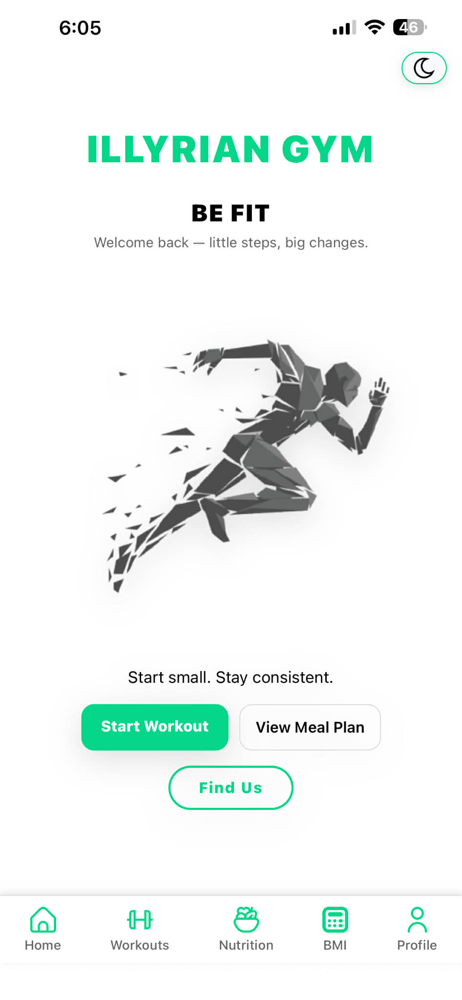
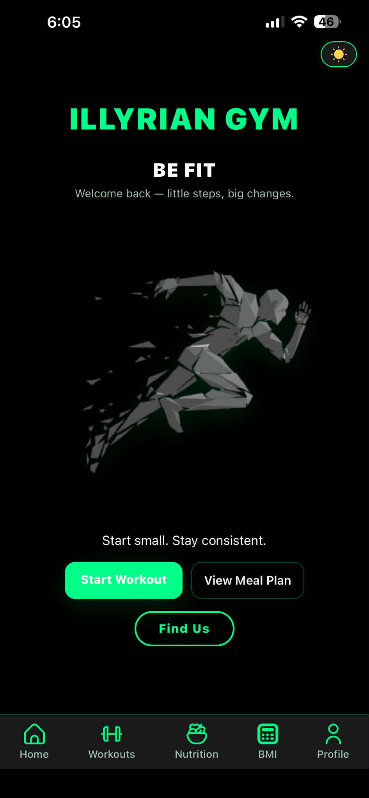
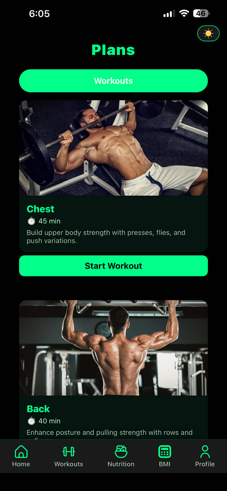
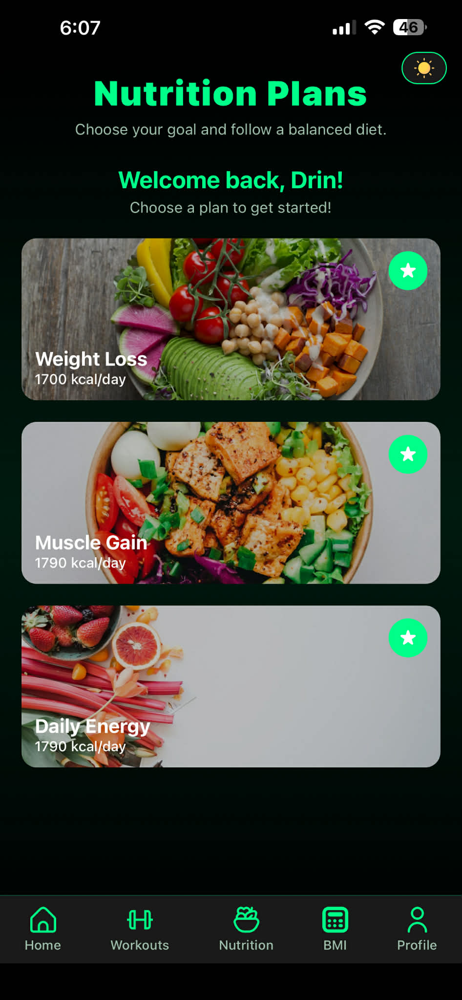
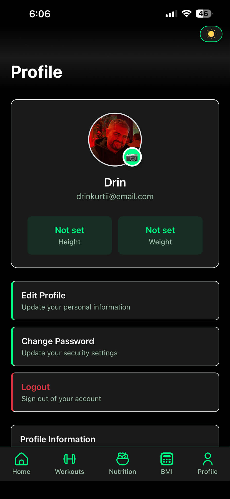
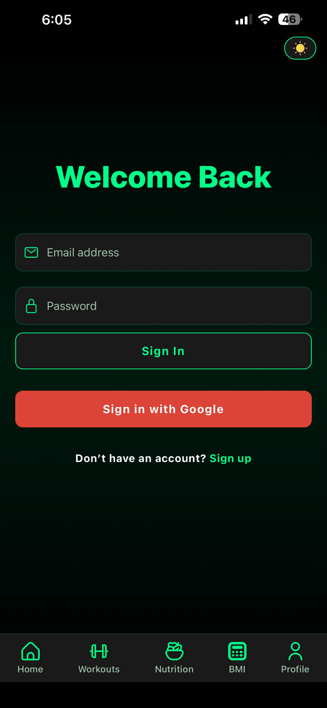

# 🏋️‍♂️ Fitness App

A modern Fitness & Health mobile application built using **React Native (Expo)**.  
The app helps users manage workouts, calculate BMI, track nutrition, follow diet plans,  
and customize their personal fitness profile – all inside a clean and intuitive UI.

---

## 👥 Group Members
- **Drin Kurti**
- **Bardh Tahiri**
- **Mehmet Mehmeti**      
- **Dion Haradinaj**  
- **Albin Bujupi**  
- **Enes Spahiu**

---
# 📌 Core Features

## 1. Functional Scope

### 🏋️ Workout Management
- Predefined workouts  
- Create / Read / Update / Delete (`CRUD`) custom workouts using Firebase Firestore
- Workout session mode with timers and checklists  
- Local images + Base64 support for uploaded images  
- Firestore persistence

### 🍎 Nutrition
- Weight Loss plan  
- Muscle Gain plan  
- Daily Energy plan  
- Nutrition list with details  

### ⚖️ BMI Calculation
- BMI formula  
- Health category interpretation  
- BmiResult component for clean output  

### 👤 User Account System
- Firebase Authentication
- Multiple authentication methods:
     - Email & Password
     - Google Authentication Provider 
- Signup / Login  
- Change Password  
- Edit Profile (Photo, Name, Height, Weight)  
- Real-time updates using **Firestore `onSnapshot()`**

### 👤 Data Management
- Firestore used as primary database
- CRUD operations implemented
- State management using:
        - `useState` for data storage
        - `useEffect` for lifecycle and Firestore subscriptions
- Explicit handling of:
        - Loading states
        - Success states
        - Error states
- Modular service layer (`services/`) to seperate business logic from UI

### 🌙 Theme System
- Dark / Light mode  
- Handled via global **ThemeContext**

### ▶️ Navigation & Routing
- Navigation implemented using Expo Router 
- File-based routing architecture 
- Central layout management using `_layout.jsx`
- Support for:
        - Public routes (login, signup)
        - Protected routes (authenticated user screens)
  - Programmatic navigation `using useRouter()`
  - Dynamic routing for workout sessions and detail screens

---

## 2. Device Features

### Image Picker
- Implemented using `expo-image-picker` 
- Allows selection of images from device gallery  
- Images are compressed before storage 
- Local images + Base64 support for uploaded images  
- Firestore persistence

### Local Notifications
- Implemented using `expo-notifications`
- Used for reminders and user feedback
- Requires development build (not Expo Go)

### Location Support (Extensible)
- Project structure supports integration with `expo-location` or Google Maps APIs 

---

## 3. UI/UX

### Layout
- Consistent spacing, padding, and alignment
- Unified color system via ThemeContext
- Responsive design for Android and iOS

### Animations
- `TouchableOpacity` for press feedback
- `Animated` API for:
     - Fade-in / fade-out effects
     - Scale animations on state change
     - UI feedback on plan selection and transitions
  
---

## 4. Performance & optimization

### List Rendering
- `FlatList` used for efficient list virtualization

### React Memoization
- `useCallback` for stable function references
- `useMemo` for caching computed values

### Component Memoization
- `React.memo` for static or rarely-changing components 

### Asset Optimization
- Image compression during upload
- Conditional rendering of media
- Static asset caching via `require()`
- Prevention of oversized assets to ensure performance stability

---

## 5. Testing
All tests are located in the `__tests__` directory.

### Snapshot Testing
- Component rendering verification
- Snapshot persistence for regression detection

### Interaction Testing
- Button press events
- Input validation logic
- Form submission flows
- Navigation triggers

### Mocking
- Firebase services
- Authentication logic
- Expo Router
- Context providers
- Native modules

Testing is performed using Jest and @testing-library/react-native.

---

### 📁 **Project Structure**
- **__tests__/**
  - `bmi.snapshot.test.js`
  - `login.interaction.test.js`
  - `signup.test.js`
    
- **app/**
  - `_layout.jsx`
  - `index.jsx`
  - `login.jsx`
  - `signup.jsx`
  - `profile.jsx`
  - `editProfile.jsx`
  - `changePassword.jsx`
  - `workouts.jsx`
  - `workoutsession.jsx`
  - `bmi.jsx`
  - `dailyenergy.jsx`
  - `musclegain.jsx`
  - `nutrition.jsx`
  - `weightloss.jsx`

- **assets/**
  - `images, icons, illustrations`

- **components/** 
  - `BmiResult.jsx`
  - `InputField.jsx`
  - `List.jsx`
  - `NutritionItem.jsx`
  - `ThemeToggle.jsx`
  - `WorkoutCard.jsx`

- **constants/**
  - `Theme.js`

- **context/**
  - `AuthContext.js`
  - `ThemeContext.jsx`

- **models/**
  - `bmiModel.js`
  - `nutritionsModel.js`
  - `workoutModel.js`

- **services/**
  - `authService.js`
  - `BMIService.js`
  - `nutritionsService.js`
  - `workoutService.js`
- `firebase.js`
- `app.json`
- `package-lock.json`
- `package.json`

---

## 📸 App Screenshots

### 🏠 Home Screens - Dark & Light Mode
<div align="center" style="margin-bottom: 40px;">
  
  
</div>

### 📱 Other Screens
<div align="center">
  
  
  
  
</div>
---

## 🛠️ **Installation Guide**

Follow these steps to run the project from zero.

### **Install Node.js**
```sh
Download & install from:
👉 https://nodejs.org/
```

### **Clone the Project**
```sh
git clone https://github.com/Drin-K/FitnessApp_Gr14.git
```

### **Open the Project**
```sh
cd FitnessApp_Gr14/theApp
```

### **Install All Dependencies**
```sh
npm install
npm install firebase
expo install react-native-safe-area-context
```

### **Configure Firebase**
#### **Open firebase.js and paste your Firebase config:**
```sh
import { initializeApp } from "firebase/app";
import { getAuth } from "firebase/auth";
import { getFirestore } from "firebase/firestore";

const firebaseConfig = {
  apiKey: "...",
  authDomain: "...",
  projectId: "...",
  storageBucket: "...",
  messagingSenderId: "...",
  appId: "..."
};

const app = initializeApp(firebaseConfig);
export const auth = getAuth(app);
export const db = getFirestore(app);
```
---
## 🚀 **Running the App**
Start development server:
```sh
npm start
```
Then choose:
- "w" → run on Web
- "a" → Android emulator / real device
- "i" → iOS simulator (Mac only)
---
## 🧠 **Future Improvements**
- Full workout tracking per day
- Push notifications
- Weekly progress charts
---
## 📸 **Overview**
This app provides a clean, minimalistic, and responsive design that ensures smooth user experience on both Android and iOS devices.
